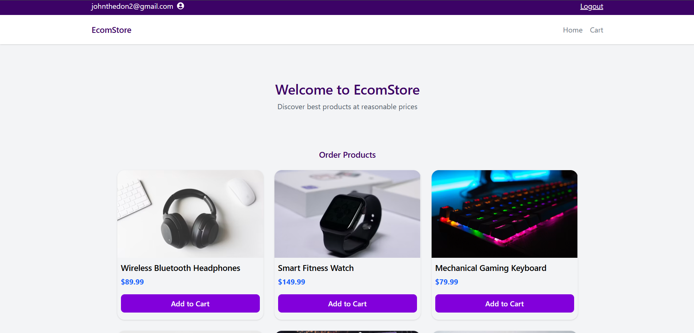
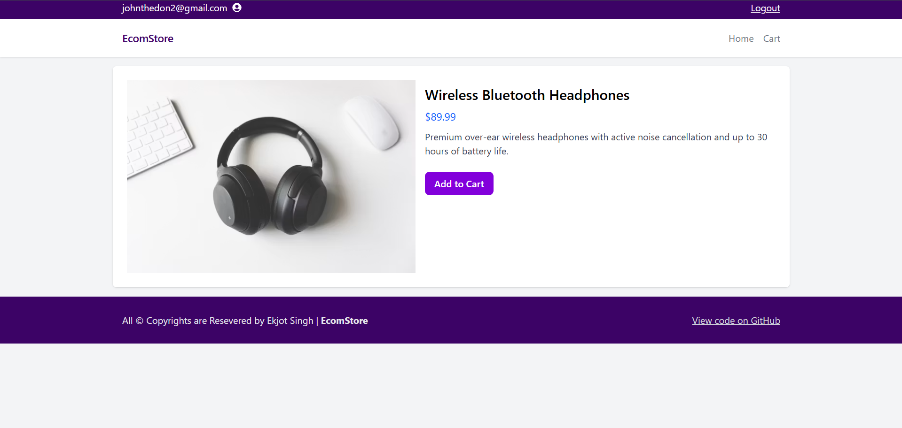
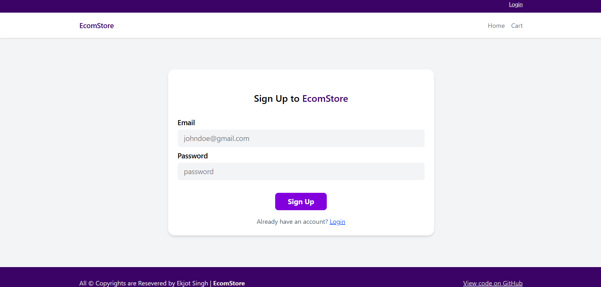
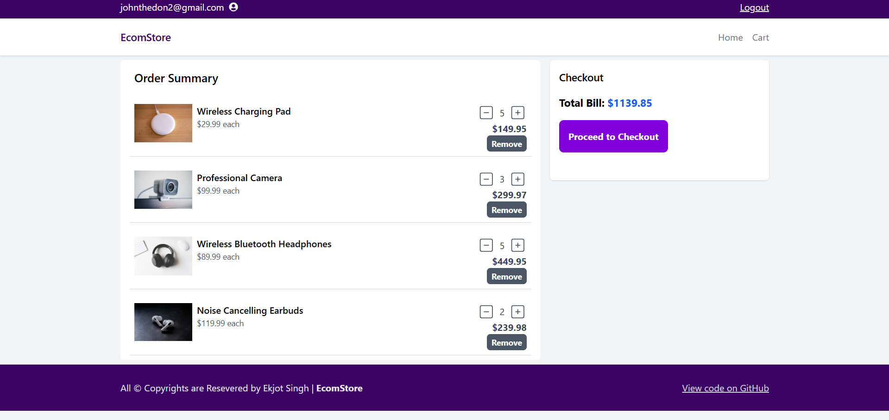

# 🛒 E-Commerce Frontend

## 📸 Screenshots

| Home | Products |
|------|----------|
|  |  |

| Cart | Checkout |
|------|----------|
|  |  |

A modern and responsive eCommerce frontend built with **React**. Users can browse products, manage their shopping cart, and experience a clean and intuitive user interface.

## ✨ Features

- 🏠 Home page with featured products
- 📦 Product listing
- 🔍 Product details page
- 🛒 Add to Cart functionality
- ❌ Remove items from cart
- ➕ Update product quantity
- 💰 Automatic total price calculation
- 📱 Responsive design
- 🔔 Toast notifications
- 📝 Form validation

## 🛠️ Tech Stack

- React
- React Router
- React Hook Form
- React Toastify
- Tailwind CSS
- JavaScript (ES6+)

## 📦 Packages Used

| Package           | Purpose                      |
|-------------------|------------------------------|
| `react-router`    | Client-side routing          |
| `react-hook-form` | Form handling and validation |
| `react-toastify`  | Beautiful toast notifications|

## 📁 Project Structure

```
src/
│── assets/
│── components/
│── context/
│── data/
│── layouts/
│── pages/
│── App.jsx
│── index.css
│── main.jsx
```

## 🚀 Installation

Clone the repository

```bash
git clone https://github.com/Ekjot1808/EcomStore.git
```

Navigate to the project folder

```bash
cd EcomStore
```

Install dependencies

```bash
npm install
```

Start the development server

```bash
npm run dev
```

## 📸 Screenshots

Add screenshots of your application here.

```
screenshots/
├── home.png
├── product-detail.png
├── checkout.png
└── auth.png
```

## 🎯 Future Improvements

- User Authentication
- Wishlist
- Product Search
- Product Filters
- Category-wise Products
- Dark Mode
- Payment Gateway Integration
- Order History
- Backend Integration

## 🤝 Contributing

Contributions are welcome!

1. Fork the repository
2. Create a new branch

```bash
git checkout -b feature-name
```

3. Commit your changes

```bash
git commit -m "Added new feature"
```

4. Push the branch

```bash
git push origin feature-name
```

5. Open a Pull Request

## 📄 License

This project is licensed under the MIT License.

## 👨‍💻 Author

Developed with ❤️ using React.